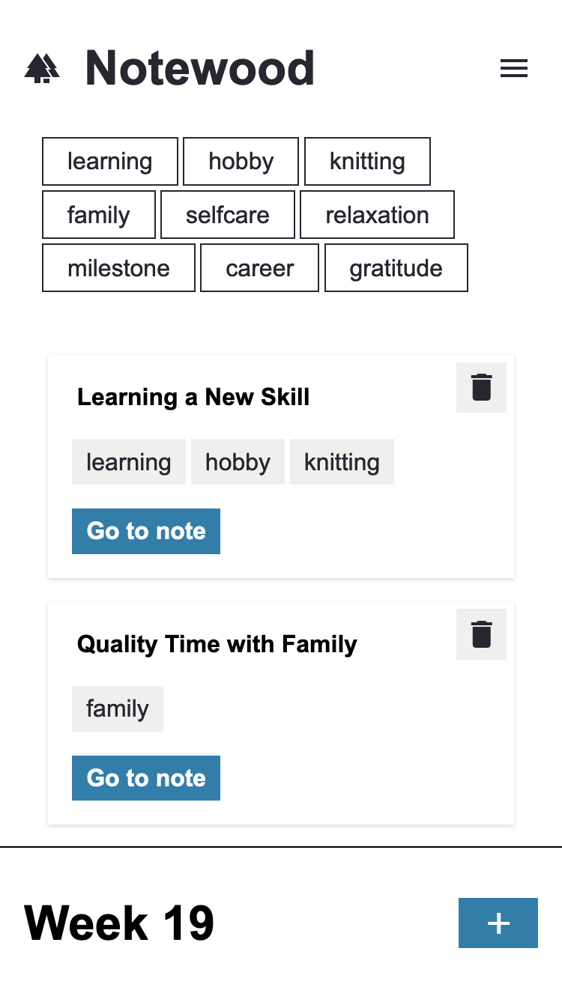
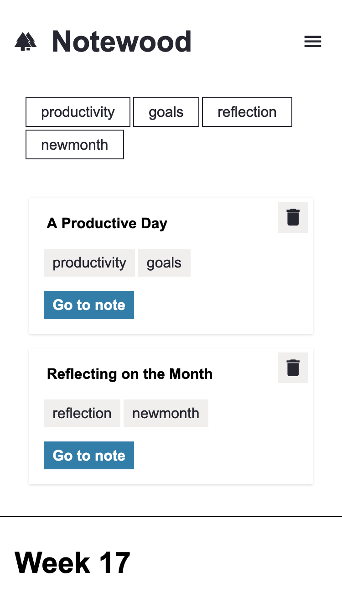
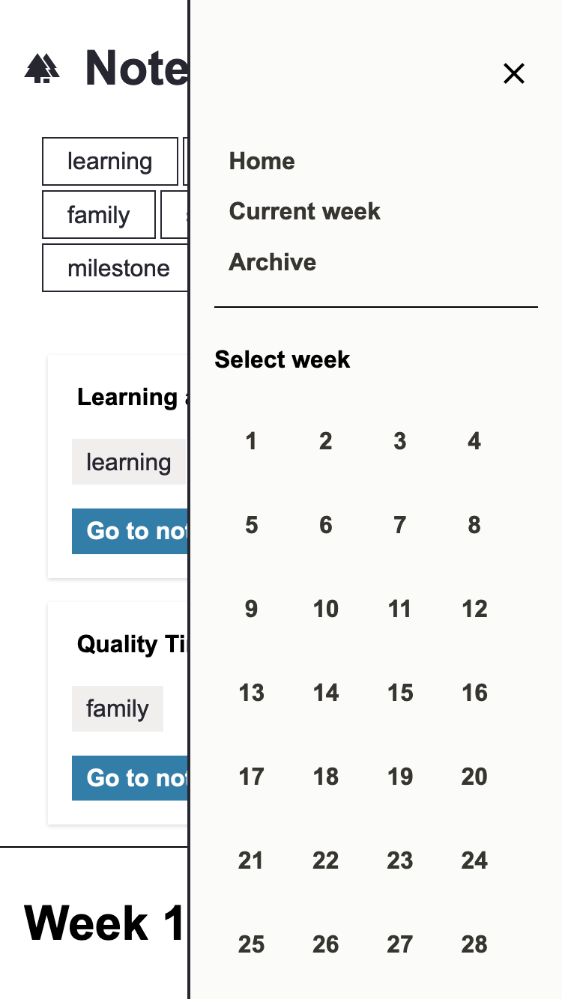
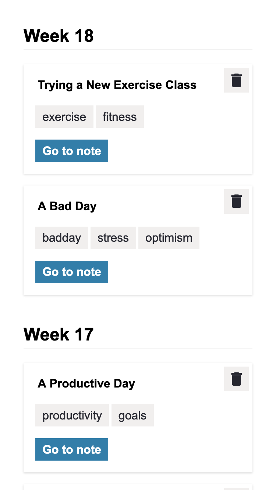

# notewood

notewood is a mixture of a note app and a diary app. It revolves around making an awareness of one's own weekly notes. This is achieved by always focusing on the current week and only be available to add notes to it. Relevant are also the tags, which can be added to each note. Through this, the topics of the week should always be recognizable at a glance. Past weeks can still be called up easily and the notes can be edited. The title of the app is a reference to the German saying I can't see the forest for the trees.

**Link to project:** https://notewood-production.up.railway.app/

  
  
   
  

## How It's Made:

**Tech used:** HTML, Sass, JavaScript, node.js, express, MongoDB, mongoose, ejs

The app is built in the MVC architecture. For the backend I used node.js with the express framework. For the database, I used MongoDB in conjunction with mongoose. The template engine used was ejs, which can be found in the views folder of the app. For easier handling with the date of each note, moment.js was used. This made it easier not only to sort the notes, but also to handle displaying the correct date.

In the cleint-side JavaScript, I mainly used Object Oriented Programming (OOP) to create interaction with the modal, for example. For the styling I used SASS. This allowed me to structure the styling better. I had originally planned to build a 7-1 structure for the SASS. But this was a bit too much because of the small amount of styling, so I deviated a bit. To reduce the browsers own stylings I used sanitize.css.

## Optimizations:

Of course there is always room for improvement e.g. refactoring. For the features, I plan to integrate the tags more into the app in the future. For example, the tags will serve as clickable filters for the notes. I'm also planning to add various quality of life features, such as visual feedback after entering the tags.

## Lessons Learned:

The app is deliberately kept simple in terms of functionality and design. The main goal was to get a better understanding of the MVC architecture and to learn how to better integrate the backend into the app. The work on client-side JavaScript was also used to be able to implement working with classes in JavaScript.
